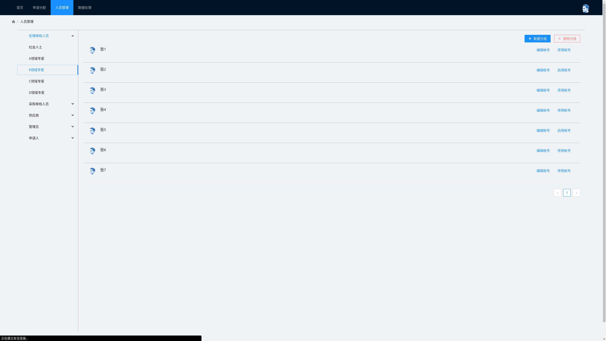
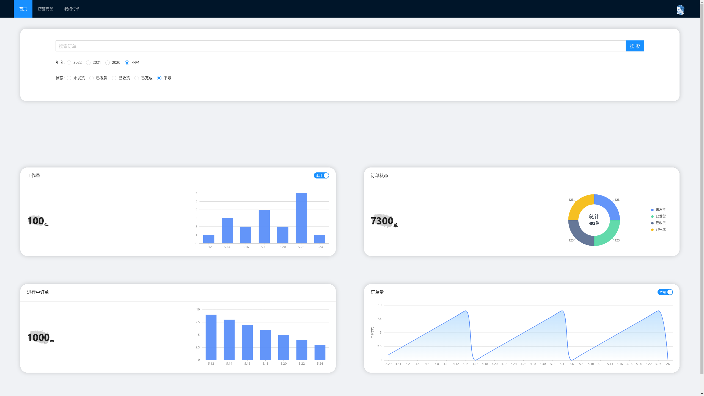
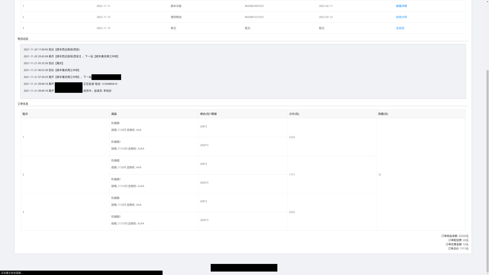

<h2 align="center">lac-oa-fa</h2>
<p align="center"><strong>校动物实验中心伦理审核与实验动物采购平台前端</strong></p>

<br/>

随着我校动物实验中心(LAC)实验人员与所需处理任务的增加，相关审批工作越来越复杂，同时申请数量的增多会导致审批关系混乱，日后的审批工作难以稳步开展，在这样的需求下，设计实现一个动物实验计划管理平台就显得十分重要, 该项目需要实现

- 线上伦理审查平台，支持申请(多种申请表模式)、审批、报表、存档、数据可视化
- 动物采购申请、审批、订单分发、配送状态显示、通知财务、存档、数据可视化

### 👀 预览

> 站点部署在学校内网, 前端 demo：[lacoa.liukairui.me](https://lacoa.liukairui.me)
>
> - 管理员账户: `adminXXX`, 密码随意
> - 申请人账户: `applyXXX`, 密码随意
> - 审核人账户: `aduitXXX`, 密码随意
> - 供应商账户: `supportXXX`, 密码随意

- 管理员
  - 首页

    

    

  - 查看申请列表

    

  - 分配审核

    

  - 人员管理

    

  - 人员信息管理

    

  - 商品信息管理

    

  - 商品信息编辑

    

  - 数据导入导出

    

- 申请人
  - 申请管理

    

  - 查看申请

    

  - 创建申请

    

    

  - 查看流转过程

    

  - 个人信息维护

    

- 审核人
  - 首页

    

  - 申请列表

    

  - 审核表单

    

- 供应商
  - 首页

    

  - 店铺管理

    

  - 商品编辑

    

  - 订单管理

    

  - 订单详情

    

    

### 🔬 技术栈

- [pnpm](https://pnpm.io/)
- [axios](https://axios-http.com/zh/)
- [vuex](https://vuex.vuejs.org/zh/)
- [vue-router](https://router.vuejs.org/zh/)
- [eslint](http://eslint.cn/)
- [prettier](https://prettier.io/)
- [husky](https://github.com/typicode/husky)
- [commitlint](https://commitlint.js.org/)
- [ant design vue](https://2x.antdv.com/docs/vue/introduce-cn/)
- [less](https://lesscss.org/)
- [G2Plot](https://g2plot.antv.vision/zh/)
- [vxe-table](https://gitee.com/xuliangzhan_admin/vxe-table)

### 🛠️ 安装

```shell
# 安装pnpm
npm install -g pnpm

# 更新包
pnpm update

# 安装全部依赖
pnpm install

# 安装某个依赖
pnpm install xxx  -D/-S

# 运行
pnpm dev

# 打包
pnpm build

# 运行mock数据
cd ./mock
node ./app.js
```

### 📃 文档

- [需求文档](./doc/需求文档.pdf)
- [API 文档](./doc/API文档.md)
- [原型图](./doc/原型图)
